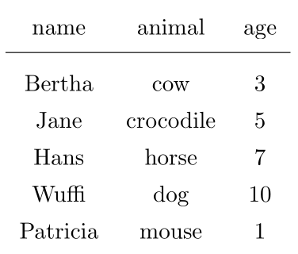
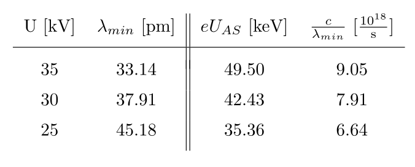

# csvtextab
Command line tool using python to convert a csv file to TeX table (tabular environment). Reads and writes to files or stdin/stdout. The examples show some reasonable ways to get tables that look relatively well. You could also call the script directly from your text editor (as a "plugin") to easily insert a table.
Examples:

## csvtest.csv

    $ python csvtextab.py csvtest.csv -V 4pt -Ll | pdflatex
	

	name, animal, age

	Bertha, cow, 3
	Jane, crocodile, 5
	Hans, horse, 7
	Wuffi, dog, 10
	Patricia, mouse, 1

## csvtest2.csv

    $ python csvtextab.py csvtest2.csv -V 5pt -Llt -a "cc||cc" | pdflatex

	U [kV], $\lambda_{min}$ [pm], $eU_{AS}$ [keV], $\frac{c}{\lambda_{min}}$ [$\frac{10^{18}}{\mathrm{s}}$]
	35, 33.14, 49.50, 9.05
	30, 37.91, 42.43, 7.91
	25, 45.18, 35.36, 6.64

# Command Line Arguments

	usage: csvtextab [-h] [-a ARGUMENT] [-c COLUMN_ORDER_INT] [-C COLUMN_ORDER_STRING] [-t]
		         [-T] [-V VSPACE] [-L] [-H] [-e ENCODING] [-v] [-f INFORMAT] [-l]
		         [-p PRETEXT] [-P POSTTEXT]
		         [infile] [outfile]

	Create tex formatted table (tabular environment) output from csv file. Leading spaces are
	stripped from the column headers. Try 'csvtextab.py -LV 4pt <INFILE>' if you are unsure
	which options to use. If not file is specified, the program reads from stdin and outputs to
	stdout. If only one file is specified, the program reads from the file and outputs to
	stdout.

	positional arguments:
	  infile                input file
	  outfile               output file

	optional arguments:
	  -h, --help            show this help message and exit
	  -a ARGUMENT, --argument ARGUMENT
		                Argument to the tabular environment. Make sure that it is
		                appropriate for the number of columns in the actual output. Default
		                is 'cccc...', i.e. as many 'c' as there are columns.
	  -c COLUMN_ORDER_INT, --column-order-int COLUMN_ORDER_INT
		                Specify the columns (as index 0..N) in the order as they should
		                appear in the tex output. A column may be specified multiple times.
		                Example: -c 1,0,0,2
	  -C COLUMN_ORDER_STRING, --column-order-string COLUMN_ORDER_STRING
		                Specify the columns (as string, i.e. the column header) in the
		                order as they should appear in the tex output. A column may be
		                specified multiple times. Example: -c name,title,name,address.
	  -t, --texheader       Do not escape column headers, assume that every header is valid
		                latex.
	  -T, --texcells        Do not escape the cells, assume that every cell in the csv file is
		                valid tex.
	  -V VSPACE, --vspace VSPACE
		                Vertical space between the rows. Parameter needs to be a valid
		                latex unit. If negative, this option cannot be used in conjunction
		                with -L (--headerline). Example: -V 5.5pt
	  -L, --headerline      Use a horizontal line after the header line (\hline). If the -V
		                (--vspace) option is specified, an empty row with a negative
		                vertical space of the same magnitude is added after the line.
	  -H, --noheader        Treat the first row as data. Use -H for files that do not have a
		                first line with column names.
	  -e ENCODING, --encoding ENCODING
		                Encoding for input and output file. Format <encoding
		                in>[,<encoding_out>] (naming as in the 'encoding' named argument of
		                the python open function). If only <encoding in> is specified, it
		                is assumed to be the encoding for both files. Example: -e utf-8
	  -v, --verbose         Enable verbose mode. Writes debug information to stderr
	  -f INFORMAT, --informat INFORMAT
		                specify input file format. 1 to 2 characters:
		                <delimiter><quotechar>.
	  -l, --latex           Output compilable latex document, i.e. a document with preamble and
		                \begin{document}...\end{document}
	  -p PRETEXT, --pretext PRETEXT
		                PRETEXT is prepended in front of the \begin{tabular}
		                command. Example: -p "\centering" for a centered table.
	  -P POSTTEXT, --posttext POSTTEXT
		                POSTTEXT is appended after the \end{tabular} command.

